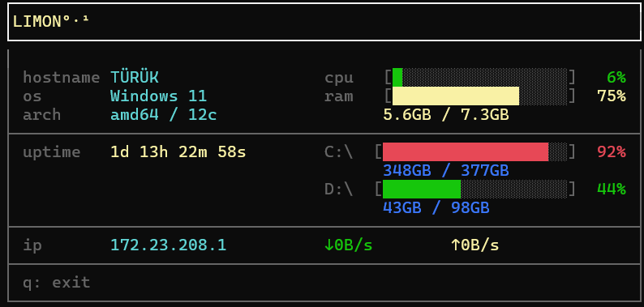

# LIMON 
 
A lightweight, cross-platform terminal system monitor.

You can see: 

- **CPU usage** — real-time usage percentage with a color-coded progress bar
- **RAM usage** — used / total memory with visual bar
- **Disk usage** — per-drive breakdown (C:\, D:\, etc.) with usage percentage
- **Network** — live download/upload speed for the active interface
- **System info** — hostname, OS, architecture, uptime, and local IP address
- **Cross-platform** — Windows and Linux support